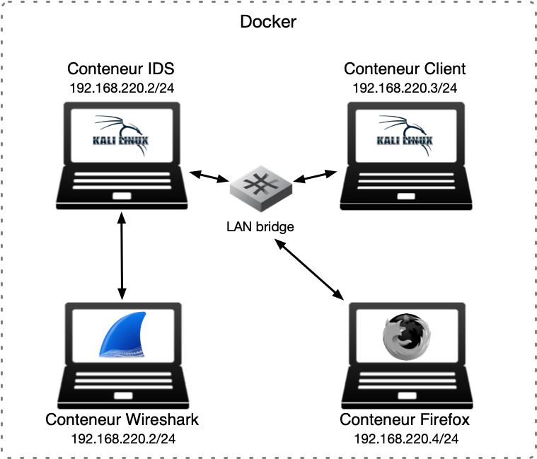
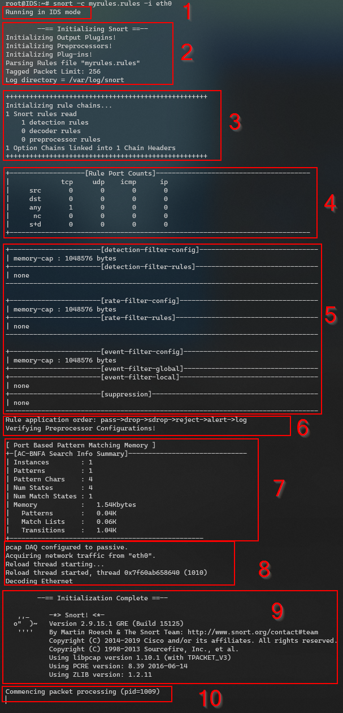
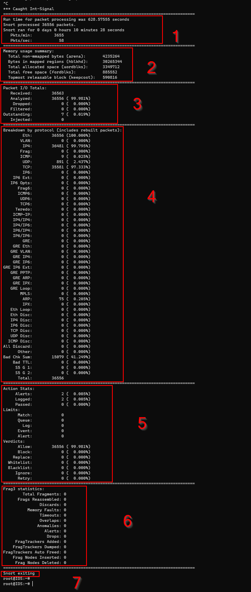
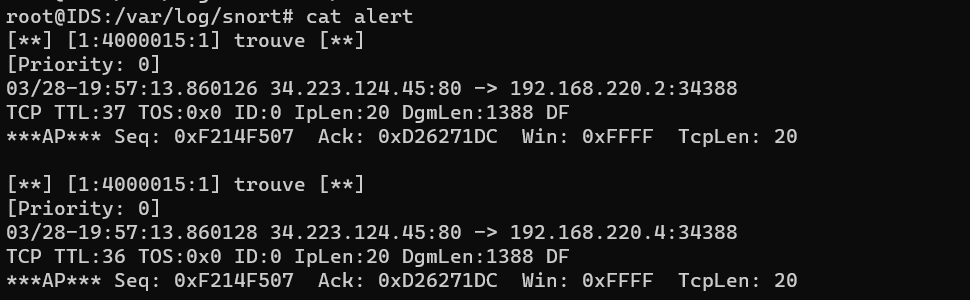
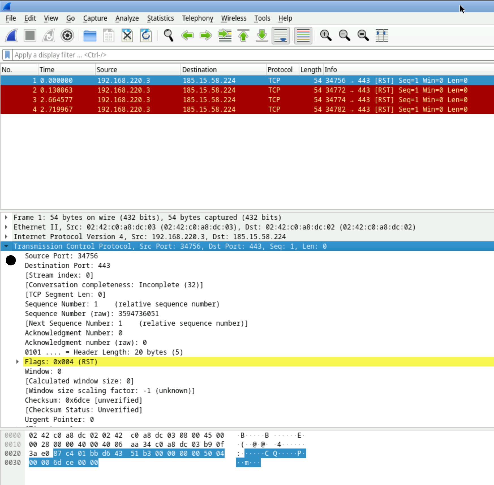
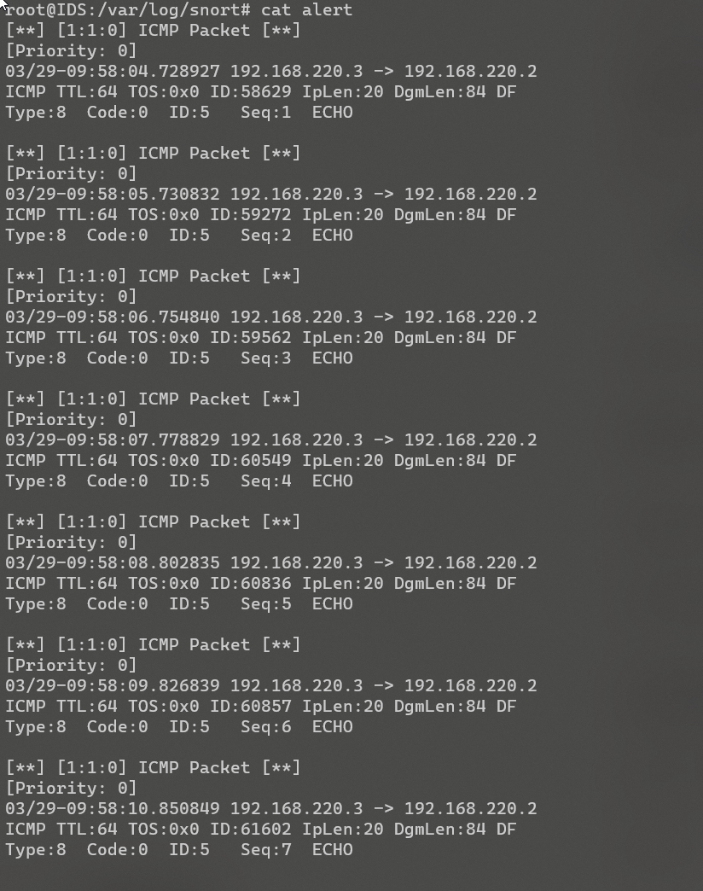
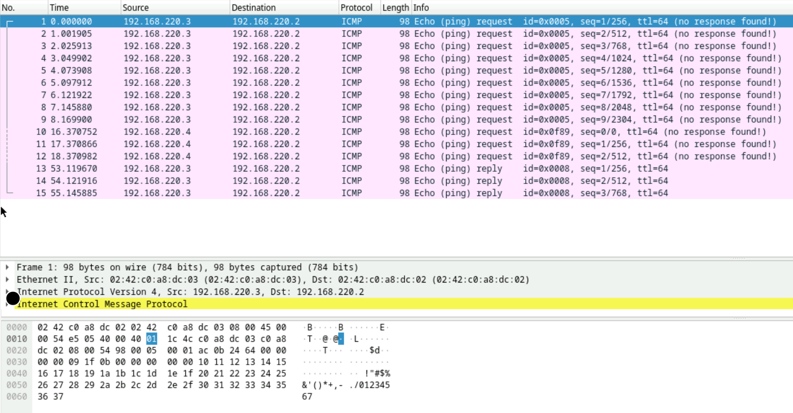
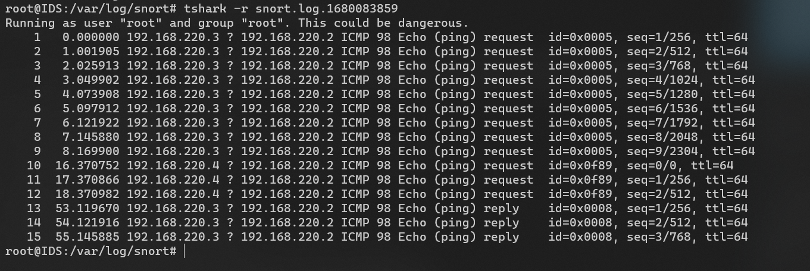
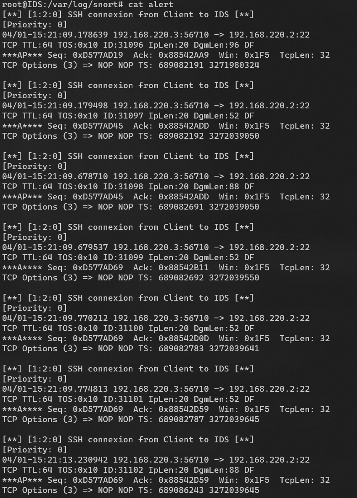
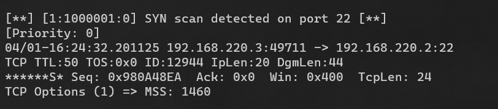

[](https://classroom.github.com/a/27yZ_HEr)
[](https://classroom.github.com/online_ide?assignment_repo_id=10557320&assignment_repo_type=AssignmentRepo)

# HEIGVD - Sécurité des Réseaux - 2023
# Laboratoire n°3 - IDS

Ce travail est à réaliser en équipes de deux personnes.
C'est le **deuxième travail noté** du cours SRX.

Vous pouvez répondre aux questions en modifiant directement votre clone du README.md ou avec un fichier pdf que vous pourrez uploader sur votre fork.

Le rendu consiste simplement à compléter toutes les parties marquées avec la mention "LIVRABLE". Le rendu doit se faire par un `git commit` sur la branche `main`.

## Table de matières

[Introduction](#introduction)

[Echéance](#echéance)

[Démarrage de l'environnement virtuel](#démarrage-de-lenvironnement-virtuel)

[Communication avec les conteneurs](#communication-avec-les-conteneurs)

[Configuration de la machine IDS et installation de Snort](#configuration-de-la-machine-ids-et-installation-de-snort)

[Essayer Snort](#essayer-snort)

[Utilisation comme IDS](#utilisation-comme-un-ids)

[Ecriture de règles](#ecriture-de-règles)

[Travail à effectuer](#exercises)

[Cleanup](#cleanup)

# Introduction

## Echéance

Ce travail devra être rendu au plus tard, **le 2 avril 2023 à 23h59.**


## Introduction

Dans ce travail de laboratoire, vous allez explorer un système de détection contre les intrusions (IDS) dont l'utilisation es très répandue grâce au fait qu'il est très performant tout en étant gratuit et open source. Il s'appelle [Snort](https://www.snort.org). Il existe des versions de Snort pour Linux et pour Windows.

### Les systèmes de détection d'intrusion

Un IDS peut "écouter" tout le traffic de la partie du réseau où il est installé. Sur la base d'une liste de règles, il déclenche des actions sur des paquets qui correspondent à la description de la règle.

Un exemple de règle pourrait être, en langage commun : "donner une alerte pour tous les paquets envoyés par le port http à un serveur web dans le réseau, qui contiennent le string 'cmd.exe'". En on peut trouver des règles très similaires dans les règles par défaut de Snort. Elles permettent de détecter, par exemple, si un attaquant essaie d'éxecuter un shell de commandes sur un serveur Web tournant sur Windows. On verra plus tard à quoi ressemblent ces règles.

Snort est un IDS très puissant. Il est gratuit pour l'utilisation personnelle et en entreprise, où il est très utilisé aussi pour la simple raison qu'il est l'un des systèmes IDS des plus efficaces.

Snort peut être exécuté comme un logiciel indépendant sur une machine ou comme un service qui tourne après chaque démarrage. Si vous voulez qu'il protège votre réseau, fonctionnant comme un IPS, il faudra l'installer "in-line" avec votre connexion Internet.

Par exemple, pour une petite entreprise avec un accès Internet avec un modem simple et un switch interconnectant une dizaine d'ordinateurs de bureau, il faudra utiliser une nouvelle machine éxecutant Snort et la placer entre le modem et le switch.


## Matériel

Vous avez besoin de votre ordinateur avec Docker et docker-compose. Vous trouverez tous les fichiers nécessaires pour générer l'environnement pour virtualiser ce labo dans le projet que vous avez cloné.
Vu qu'il faudra aussi faire un nat, sous Windows vous avez besoin de configurer votre docker pour
utiliser "Hyper-V" au lieu de "WSL2". Il faut désactiver la configuration [Use the WSL2 based engine](https://docs.docker.com/desktop/settings/windows/).


## Démarrage de l'environnement virtuel

Ce laboratoire utilise docker-compose, un outil pour la gestion d'applications utilisant multiples conteneurs. Il va se charger de créer un réseaux virtuel `snortlan`, la machine IDS, un client avec un navigateur Firefox, une machine "Client" et un conteneur Wireshark directement connecté à la même interface réseau que la machine IDS. Le réseau LAN interconnecte les autres 3 machines (voir schéma ci-dessous).



Nous allons commencer par lancer docker-compose. Il suffit de taper la commande suivante dans le répertoire racine du labo, celui qui contient le fichier [docker-compose.yml](docker-compose.yml). Optionnelement vous pouvez lancer le script [up.sh](scripts/up.sh) qui se trouve dans le répertoire [scripts](scripts), ainsi que d'autres scripts utiles pour vous :

```bash
docker-compose up --detach
```

Le téléchargement et génération des images prend peu de temps.

Les images utilisées pour les conteneurs client et la machine IDS sont basées sur l'image officielle Kali. Le fichier [Dockerfile](Dockerfile) que vous avez téléchargé contient les informations nécessaires pour la génération de l'image de base. [docker-compose.yml](docker-compose.yml) l'utilise comme un modèle pour générer ces conteneurs. Les autres deux conteneurs utilisent des images du groupe LinuxServer.io. Vous pouvez vérifier que les quatre conteneurs sont crées et qu'ils fonctionnent à l'aide de la commande suivante.

```bash
docker ps
```

## Communication avec les conteneurs

Afin de simplifier vos manipulations, les conteneurs ont été configurées avec les noms suivants :

- IDS
- Client
- wireshark
- firefox

Pour accéder au terminal de l’une des machines, il suffit de taper :

```bash
docker exec -it <nom_de_la_machine> /bin/bash
```

Par exemple, pour ouvrir un terminal sur votre IDS :

```bash
docker exec -it IDS /bin/bash
```

Vous pouvez bien évidemment lancer des terminaux communiquant avec toutes les machines en même temps ou même lancer plusieurs terminaux sur la même machine. ***Il est en fait conseillé pour ce laboratoire de garder au moins deux terminaux ouverts sur la machine IDS en tout moment***.


### Configuration de la machine Client et de firefox

Dans un terminal de votre machine Client et de la machine firefox, taper les commandes suivantes :

```bash
ip route del default
ip route add default via 192.168.220.2
```

Ceci configure la machine IDS comme la passerelle par défaut pour les deux autres machines.


## Configuration de la machine IDS et installation de Snort

Pour permettre à votre machine Client de contacter l'Internet à travers la machine IDS, il faut juste une petite règle NAT par intermédiaire de nftables sur la machine IDS.
Si votre machine hôte est un Windows, il ne faut pas oublier de changer la configuration docker pour utiliser hyper-v.

```bash
nft add table nat
nft 'add chain nat postrouting { type nat hook postrouting priority 100 ; }'
nft add rule nat postrouting meta oifname "eth0" masquerade
```

Cette commande `iptables` définit une règle dans le tableau NAT qui permet la redirection de ports et donc, l'accès à l'Internet pour la machine Client.

On va maintenant installer Snort sur le conteneur IDS.

La manière la plus simple c'est d'installer Snort en ligne de commandes. Il suffit d'utiliser la commande suivante :

```
apt update && apt install -y snort
```

Ceci télécharge et installe la version la plus récente de Snort.

Il est possible que vers la fin de l'installation, on vous demande de fournir deux informations :

- Le nom de l'interface sur laquelle snort doit surveiller - il faudra répondre ```eth0```
- L'adresse de votre réseau HOME. Il s'agit du réseau que vous voulez protéger. Cela sert à configurer certaines variables pour Snort. Vous pouvez répondre ```192.168.220.0/24```.


## Essayer Snort

Une fois installé, vous pouvez lancer Snort comme un simple "sniffer". Pourtant, ceci capture tous les paquets, ce qui peut produire des fichiers de capture énormes si vous demandez de les journaliser. Il est beaucoup plus efficace d'utiliser des règles pour définir quel type de trafic est intéressant et laisser Snort ignorer le reste.

Snort se comporte de différentes manières en fonction des options que vous passez en ligne de commande au démarrage. Vous pouvez voir la grande liste d'options avec la commande suivante :

```
snort --help
```

On va commencer par observer tout simplement les entêtes des paquets IP utilisant la commande :

```
snort -v -i eth0
```

**ATTENTION : le choix de l'interface devient important si vous avez une machine avec plusieurs interfaces réseau. Dans notre cas, vous pouvez ignorer entièrement l'option ```-i eth0``` et cela devrait quand-même fonctionner correctement.**

Snort s'éxecute donc et montre sur l'écran tous les entêtes des paquets IP qui traversent l'interface eth0. Cette interface reçoit tout le trafic en provenance de la machine "Client" puisque nous avons configuré le IDS comme la passerelle par défaut.

Pour arrêter Snort, il suffit d'utiliser `CTRL-C`.

**attention** : généralement, ceci fonctionne si vous patientez un moment... Snort est occupé en train de gérer le contenu du tampon de communication et cela qui peut durer quelques secondes. Cependant, il peut arriver de temps à autres que Snort ne réponde plus correctement au signal d'arrêt. Dans ce cas-là on peut utliliser `CTRL-Z`, puis lancer la commande `pkill -f -9 snort`.


## Utilisation comme un IDS

Pour enregistrer seulement les alertes et pas tout le trafic, on execute Snort en mode IDS. Il faudra donc spécifier un fichier contenant des règles.

Il faut noter que `/etc/snort/snort.config` contient déjà des références aux fichiers de règles disponibles avec l'installation par défaut. Si on veut tester Snort avec des règles simples, on peut créer un fichier de config personnalisé (par exemple `mysnort.conf`) et importer un seul fichier de règles utilisant la directive "include".

Les fichiers de règles sont normalement stockés dans le répertoire `/etc/snort/rules/`, mais en fait un fichier de config et les fichiers de règles peuvent se trouver dans n'importe quel répertoire de la machine.

Par exemple, créez un fichier de config `mysnort.conf` dans le repertoire `/etc/snort` avec le contenu suivant :

```
include /etc/snort/rules/icmp2.rules
```

Ensuite, créez le fichier de règles `icmp2.rules` dans le repertoire `/etc/snort/rules/` et rajoutez dans ce fichier le contenu suivant :

```
alert icmp any any -> any any (msg:"ICMP Packet"; sid:4000001; rev:3;)
```

On peut maintenant éxecuter la commande :

```
snort -c /etc/snort/mysnort.conf
```

Vous pouvez maintenant faire quelques pings depuis votre "Client" et regarder les résultas dans le fichier d'alertes contenu dans le repertoire `/var/log/snort/`.

## Enlever les avertissements

Si on applique la règle en haut et qu'on fait un ping depuis une des machines `firefox` ou `Client`, snort
affiche l'avertissement suivant:

```
WARNING: No preprocessors configured for policy 0.
```

Ceci veut dire que snort a détécté une ou plusieurs règles qui ne sont pas précédées par un préprocesseur.
Pour ajouter un préprocesseur, vous pouvez ajouter la ligne suivante au début de votre fichier de configuration:

```
preprocessor frag3_global: max_frags 65536
```

## Ecriture de règles

Snort permet l'écriture de règles qui décrivent des tentatives de exploitation de vulnérabilités bien connues. Les règles Snort prennent en charge à la fois, l'analyse de protocoles et la recherche et identification de contenu.

Il y a deux principes de base à respecter :

* Une règle doit être entièrement contenue dans une seule ligne
* Les règles sont divisées en deux sections logiques : (1) l'entête et (2) les options.

L'entête de la règle contient l'action de la règle, le protocole, les adresses source et destination, et les ports source et destination.

L'option contient des messages d'alerte et de l'information concernant les parties du paquet dont le contenu doit être analysé. Par exemple:

```
alert tcp any any -> 192.168.220.0/24 111 (content:"|00 01 86 a5|"; msg: "mountd access";)
```

Cette règle décrit une alerte générée quand Snort trouve un paquet avec tous les attributs suivants :

* C'est un paquet TCP
* Emis depuis n'importe quelle adresse et depuis n'importe quel port
* A destination du réseau identifié par l'adresse 192.168.220.0/24 sur le port 111

Le text jusqu'au premier parenthèse est l'entête de la règle.

```
alert tcp any any -> 192.168.220.0/24 111
```

Les parties entre parenthèses sont les options de la règle:

```
(content:"|00 01 86 a5|"; msg: "mountd access";)
```

Les options peuvent apparaître une ou plusieurs fois. Par exemple :

```
alert tcp any any -> any 21 (content:"site exec"; content:"%"; msg:"site
exec buffer overflow attempt";)
```

La clé "content" apparait deux fois parce que les deux strings qui doivent être détectés n'apparaissent pas concaténés dans le paquet mais a des endroits différents. Pour que la règle soit déclenchée, il faut que le paquet contienne **les deux strings** "site exec" et "%".

Les éléments dans les options d'une règle sont traités comme un AND logique. La liste complète de règles sont traitées comme une succession de OR.

## Informations de base pour le règles

### Actions :

```
alert tcp any any -> any any (msg:"My Name!"; content:"Skon"; sid:1000001; rev:1;)
```

L'entête contient l'information qui décrit le "qui", le "où" et le "quoi" du paquet. Ça décrit aussi ce qui doit arriver quand un paquet correspond à tous les contenus dans la règle.

Le premier champ dans le règle c'est l'action. L'action dit à Snort ce qui doit être fait quand il trouve un paquet qui correspond à la règle. Il y a six actions :

* alert - générer une alerte et écrire le paquet dans le journal
* log - écrire le paquet dans le journal
* pass - ignorer le paquet
* drop - bloquer le paquet et l'ajouter au journal
* reject - bloquer le paquet, l'ajouter au journal et envoyer un `TCP reset` si le protocole est TCP ou un `ICMP port unreachable` si le protocole est UDP
* sdrop - bloquer le paquet sans écriture dans le journal

### Protocoles :

Le champ suivant c'est le protocole. Il y a trois protocoles IP qui peuvent être analysés par Snort : TCP, UDP et ICMP.


### Adresses IP :

La section suivante traite les adresses IP et les numéros de port. Le mot `any` peut être utilisé pour définir "n'import quelle adresse". On peut utiliser l'adresse d'une seule machine ou un block avec la notation CIDR.

Un opérateur de négation peut être appliqué aux adresses IP. Cet opérateur indique à Snort d'identifier toutes les adresses IP sauf celle indiquée. L'opérateur de négation est le `!`.

Par exemple, la règle du premier exemple peut être modifiée pour alerter pour le trafic dont l'origine est à l'extérieur du réseau :

```
alert tcp !192.168.220.0/24 any -> 192.168.220.0/24 111
(content: "|00 01 86 a5|"; msg: "external mountd access";)
```

### Numéros de Port :

Les ports peuvent être spécifiés de différentes manières, y-compris `any`, une définition numérique unique, une plage de ports ou une négation.

Les plages de ports utilisent l'opérateur `:`, qui peut être utilisé de différentes manières aussi :

```
log udp any any -> 192.168.220.0/24 1:1024
```

Journaliser le traffic UDP venant d'un port compris entre 1 et 1024.

--

```
log tcp any any -> 192.168.220.0/24 :6000
```

Journaliser le traffic TCP venant d'un port plus bas ou égal à 6000.

--

```
log tcp any :1024 -> 192.168.220.0/24 500:
```

Journaliser le traffic TCP venant d'un port privilégié (bien connu) plus grand ou égal à 500 mais jusqu'au port 1024.


### Opérateur de direction

L'opérateur de direction `->`indique l'orientation ou la "direction" du trafique.

Il y a aussi un opérateur bidirectionnel, indiqué avec le symbole `<>`, utile pour analyser les deux côtés de la conversation. Par exemple un échange telnet :

```
log 192.168.220.0/24 any <> 192.168.220.0/24 23
```

## Alertes et logs Snort

Si Snort détecte un paquet qui correspond à une règle, il envoie un message d'alerte ou il journalise le message. Les alertes peuvent être envoyées au syslog, journalisées dans un fichier text d'alertes ou affichées directement à l'écran.

Le système envoie **les alertes vers le syslog** et il peut en option envoyer **les paquets "offensifs" vers une structure de repertoires**.

Les alertes sont journalisées via syslog dans le fichier `/var/log/snort/alerts`. Toute alerte se trouvant dans ce fichier aura son paquet correspondant dans le même repertoire, mais sous le fichier `snort.log.xxxxxxxxxx` où `xxxxxxxxxx` est l'heure Unix du commencement du journal.

Avec la règle suivante :

```
alert tcp any any -> 192.168.220.0/24 111
(content:"|00 01 86 a5|"; msg: "mountd access";)
```

un message d'alerte est envoyé à syslog avec l'information "mountd access". Ce message est enregistré dans `/var/log/snort/alerts` et le vrai paquet responsable de l'alerte se trouvera dans un fichier dont le nom sera `/var/log/snort/snort.log.xxxxxxxxxx`.

Les fichiers log sont des fichiers binaires enregistrés en format pcap. Vous pouvez les ouvrir avec Wireshark ou les diriger directement sur la console avec la commande suivante :

```
tcpdump -r /var/log/snort/snort.log.xxxxxxxxxx
```

Vous pouvez aussi utiliser des captures Wireshark ou des fichiers snort.log.xxxxxxxxx comme source d'analyse por Snort.

## Exercices

**Réaliser des captures d'écran des exercices suivants et les ajouter à vos réponses.**

### Essayer de répondre à ces questions en quelques mots, en réalisant des recherches sur Internet quand nécessaire :

**Question 1: Qu'est ce que signifie les "preprocesseurs" dans le contexte de Snort ?**

---

Ce sont des modules qui analysent et traitent les paquets de données avant que les règles de détection ne soient appliquées. Les préprocesseurs peuvent être utilisé à des fin de :

- Analyse de protocole

  Les préprocesseurs peuvent analyser des protocoles spécifiques tels que HTTP, SMTP, FTP, etc., afin de détecter des anomalies et des violations de protocoles.

- Défragmentation

  Ils peuvent reconstituer des paquets fragmentés, permettant à Snort de détecter des attaques qui cherchent à éviter la détection en fragmentant les paquets.

- Normalisation

  Ils peuvent normaliser le trafic réseau afin de garantir que les paquets sont analysés de manière cohérente, indépendamment de la manière dont ils sont faits ou encodés.

- Détection des anomalies

  Ils peuvent détecter des comportements anormaux sur le trafic réseau tels que des scans de ports, des balayages réseau ou encore des tentatives de connexion échouées répétées.

En résumé, les préprocesseurs améliorent l'utilisation de Snort en analysant le trafic avant que les règles de détection ne soient appliquées, ce qui améliore la précision et l'efficacité de l'IDS.

---

**Question 2: Pourquoi êtes vous confronté au WARNING suivant `"No preprocessors configured for policy 0"` lorsque vous exécutez la commande `snort` avec un fichier de règles ou de configuration "fait-maison" ?**

---

L'apparition du message mentionné dans la question est due au fait que Snort ne détecte aucune configuration de préprocesseur pour la politique de sécurité 0 (politique par défaut) dans le fichier de configuration personnalisé que nous avons créé.

---

### Trouver du contenu :

Considérer la règle simple suivante:

```

alert tcp any any -> any any (msg:"Mon nom!"; content:"Rubinstein"; sid:4000015; rev:1;)

```

**Question 3: Qu'est-ce qu'elle fait la règle et comment ça fonctionne ?**

---

Cette règle génère une alerte lorsqu'elle détecte un certain contenu dans un paquet TCP. Voici une explication détaillée de chaque partie de la règle afin de comprendre son fonctionnement global :

- `alert` : Snort doit générer une alerte lorsqu'un paquet correspondant est détecté.
- `tcp` : protocole que la règle doit surveiller.
- `any any -> any any` : adresse et port source ainsi que l'adresse et le port de destination. Le mot-clé `any` signifie que la règle s'applique à n'importe quelle adresse IP et n'importe quel port.
- `msg:"mon nom!"` : message d'alerte affiché lors que la règle est déclenchée.
- `content:"Rubinstein` : critère de contenu de la règle, qui déclenche l'alerte lorsque la chaîne de caractères "Rubinstein" est détectée dans un paquet TCP.
- `sid_4000015` : ID de la règle. Chaque règle doit avoir un identifiant unique afin de permettre une gestion appropriée.
- `rev:1;` : Révision de la règle. Utilisée afin d'avoir un suivi temporel des modifications apportées à la règle.

En résumé, la règle susmentionnée génère une alerte avec le message "Mon nom!" lorsqu'elle détecte un paquet TCP contenant la chaîne de caractères "Rubinstein", ceci indépendamment des adresses et des ports source et de destination.

Note: `sid_4000015` est faux, il faudrait écrire : `sid:4000015`

---

Utiliser nano ou vim pour créer un fichier `myrules.rules` sur votre répertoire home (`/root`). Rajouter une règle comme celle montrée avant mais avec votre text, phrase ou mot clé que vous aimeriez détecter. Lancer Snort avec la commande suivante :

```
snort -c myrules.rules -i eth0
```

**Question 4: Que voyez-vous quand le logiciel est lancé ? Qu'est-ce que tous ces messages affichés veulent dire ?**

---

Message :



Explication du contenu (la numérotation correspond à la capture d'écran ci-dessus) :

1. La première ligne `Running in IDS mode` signifie que la machine hôte de l'application Snort fonctionne maintenant en mode IDS.

2. Le bloc de texte suivant indique le Snort initialise le plugin de sortie, les préprocesseurs ainsi que les plugins. Il indique également qu'il analyse le fichier contenant la(les) règles(s) passé en paramètre lors de l'exécution de l'application. Finalement il indique le nombre limite de paquets étiquetés et le dossier contenant les logs (`/var/log/snort`).

3. Cette partie du message nous fournit des informations sur les règles chargées à partir du fichier de configuration. Dans notre cas :

   - 1 règle Snort a été lue
     - 1 règle de détection
     - 0 règle de décodeur
     - 0 règle de préprocesseur
   - 1 chaine d'option liée à 1 en-tête de chaine

4. Résumé  des comptages des ports des règles chargées depuis le fichier de règles. Dans notre cas on a uniquement 1 règle avec le mot-clé `any` pour une règle concernant le protocole TCP.

5. Cette partie fournit des informations sur la configuration des différents filtres disponibles dans Snort :

   - Detection-filter :
     - `memory-cap : 1048576 bytes` : La limite de mémoire pour les filtres de détection est définie à 1048576 bytes (1 Mo).
     - `detection-filter-rules : none` : Aucune règle de filtre de détection n'est configurée. Les filtres de détection sont utilisés pour limiter le déclenchement d'alertes lorsqu'un certain seuil de déclenchements d'alertes est atteint dans un intervalle de temps spécifié.
   - Rate-filter :
     - `memory-cap : 1048576 bytes` : La limite de mémoire pour les filtres de taux est définie à 1048576 bytes (1 Mo).
     - `rate-filter-rules : none` : Aucune règle de filtre de taux n'est configurée. Les filtres de taux sont utilisés pour limiter le déclenchement d'alertes lorsque le taux d'alertes dépasse un certain seuil.
   - Event-filter :
     - `memory-cap : 1048576 bytes` : La limite de mémoire pour les filtres d'événements est définie à 1048576 bytes (1 Mo).
     - `event-filter-global : none` : Aucune configuration globale de filtre d'événements n'est définie.
     - `event-filter-local : none` : Aucune règle de filtre d'événements locale n'est configurée. Les filtres d'événements sont utilisés pour limiter le nombre d'alertes déclenchées pour des événements spécifiques.
     - `suppression : none` : Aucune règle de suppression n'est configurée. Les règles de suppression sont utilisées pour supprimer certaines alertes en fonction de critères spécifiques.

6. Affiche l'ordre d'application des règles et qu'il vérifie les configurations des préprocésseurs.

7. Affiche des informations sur la mémoire utilisée pour la recherche de motifs basée sur les ports.

   Snort utilise un algorithme de recherche de motifs appelé "Aho-Corasick with Built-In Non-deterministic Finite Automaton" (AC-BNFA).

   Voici les détails de cette partie du message :

   - `Instances` : Le nombre d'instances de l'algorithme de recherche AC-BNFA utilisées (1 dans ce cas).

   - `Patterns` : Le nombre de motifs de recherche dans les règles chargées (1 dans ce cas, qui correspond au motif "Rubinstein" dans la règle que vous avez fournie).

   - `Pattern Chars` : Le nombre total de caractères dans les motifs (4 dans ce cas, correspondant aux 4 caractères de "Rubinstein").

   - `Num States` : Le nombre total d'états dans l'automate fini non-déterministe (4 dans ce cas).

   - `Num Match States` : Le nombre d'états correspondant à des motifs trouvés (1 dans ce cas).

   - `Memory` : La mémoire totale utilisée par l'automate fini non-déterministe (1,54 Ko dans ce cas). Cette mémoire est répartie entre les éléments suivants :
     - `Patterns` : La mémoire utilisée pour stocker les motifs (0,04 Ko).
     - `Match Lists` : La mémoire utilisée pour stocker les listes de correspondances (0,06 Ko).
     - `Transitions` : La mémoire utilisée pour stocker les transitions entre les états (1,04 Ko).

8. Cette partie du message indique Snort est prêt à commencer à analyser le trafic réseau en utilisant l'interface `eth0` ce qui avait été demandé dans la commande d'exécution de Snort. Voici les détails ligne par ligne du contenu de cette partie du message :

   - `pcap DAQ configured to passive.` : Snort utilise le module "pcap" (Packet Capture) comme dispositif d'acquisition de paquets (DAQ) en mode passif. Cela signifie que Snort capture et analyse les paquets, mais ne modifie pas ou n'interagit pas avec le trafic réseau.

   - `Acquiring network traffic from "eth0".` : Snort commence à acquérir et à analyser le trafic réseau à partir de l'interface réseau "eth0".

   - `Reload thread starting...` : Un nouveau thread de rechargement est lancé. Ce thread permet de recharger la configuration de Snort et les règles à la volée, sans interrompre l'analyse du trafic réseau.

   - `Reload thread started, thread 0x7f60ab658640 (1010)` : Le thread de rechargement a démarré avec succès et est identifié par l'adresse mémoire 0x7f60ab658640 et le numéro de thread 1010.- -
   - `Decoding Ethernet` : Snort décode les paquets capturés en utilisant le protocole Ethernet. Cela signifie que Snort est prêt à analyser les paquets Ethernet et à appliquer les règles de détection définies dans votre fichier de règles.

9. Indique que l'initialisation de Snort est terminée et que le système est prêt à commencer à analyser le réseaux.

   Il donne plusieurs information tel que la version de Snort utilisée, Le nom du développeur et de son équipe ainsi qu'un lien vers le site web officiel, que le droit appartiennent à Cisco et ses affiliés, qu'avant qu'il appartienne à Cisco Snort appartenait à SourceFile et finalement les version des bibliothèques PCRE et ZLIB utilisée respectivement pour la gestion des expressions régulières et de la compression/décompression.

10. Snort a commencé à analyser le réseau et que son processus peut être identifié par le PID 1009 (ID du processus, c.f. cours de Système d'Exploitation SYE).

---

Aller sur un site web contenant dans son texte la phrase ou le mot clé que vous avez choisi (il faudra chercher un peu pour trouver un site en http... Si vous n'y arrivez pas, vous pouvez utiliser [http://neverssl.com](http://neverssl.com) et modifier votre  règle pour détecter un morceau de texte contenu dans le site).

Pour accéder à Firefox dans son conteneur, ouvrez votre navigateur web sur votre machine hôte et dirigez-le vers [http://localhost:4000](http://localhost:4000). Optionnellement, vous pouvez utiliser wget sur la machine client pour lancer la requête http ou le navigateur Web lynx - il suffit de taper `lynx neverssl.com`. Le navigateur lynx est un navigateur basé sur texte, sans interface graphique.
Chez moi, Linus, je n'arrive pas à entrer du texte si j'utilise le lien sous Firefox. Mais sous Safari et Chrome ça marche.

**Question 5: Que voyez-vous sur votre terminal quand vous chargez le site depuis Firefox ou la machine Client ?**

---

Rien ne se passe dans le terminal. Il est fort probable que c'est dut au même problème que rencontré par des autres groupes en classe et déjà reporté à l'équipe d'enseignement.

---

Arrêter Snort avec `CTRL-C`.

**Question 6: Que voyez-vous quand vous arrêtez snort ? Décrivez en détail toutes les informations qu'il vous fournit.**

---

Message :



Explication du contenu (la numérotation correspond à la capture d'écran ci-dessus) :

1. Des informations générales sur l'utilisation que l'on viens de faire de Snort :
   - Le temps d'exécution pour le traintement des paquets (628.57555 seconds)
   - Le nombre de paquets analysés (36556)
   - La durée d'exécution de Snort en jours, heures, minutes et secondes
   - Le nombre de paquets moyen par minute et par seconde
2. Un résumé sur l'utilisation de la mémoire :
   - `Total non-mmapped bytes (arena)` : nombre total d'octets alloué par Snort pour stocker les objets qui ne sont pas des fichiers mappés en mémoire
   - `Bytes in mapped regions (hblkhd)` : taille totale de la mémoire allouée par Snort pour les fichiers mappé en mémoire
   - `Total allocated space (uordblks)` : quantité totale d'espace alloué par Snort pour les blocs de mémoire qui ont été alloués par l'utilisateur     
   - `Total free space (fordblks)` : quantité totale d'espace libre dans la mémoire allouée par Snort
   - `Topmost releasable block (keepcost)` : taille du plus grand bloc de mémoire qui peut être libéré (releasable) par Snort sans causer de fragmentation de la mémoire
3. Nombre de des paquets traités par type (reçu, analysé, abandonné, filtré, en suspend, injecté)
4. Des statistiques sur le nombre de paquets reçus, analysés, abandonnés et filtrés par protocole
5. Des informations sur les actions prises par Snort, telles que les alertes et les journaux, ainsi que des statistiques sur les verdicts
6. Des statistiques sur les fragments de paquets (s'il y en avait) qui ont été réassemblés
7. Le programme Snort se termine et quitte

---


Aller au répertoire /var/log/snort. Ouvrir le fichier `alert`. Vérifier qu'il y ait des alertes pour votre texte choisi.

**Question 7: A quoi ressemble l'alerte ? Qu'est-ce que chaque élément de l'alerte veut dire ? Décrivez-la en détail !**

---

Message :



Explication du contenu :

le contenu affiche deux alertes IDS déclenchées par la règle de détection n°1:4000015:1, qui affiche le message "trouve" comme demandé dans la règle préalablement définie. Les alertes contiennent les informations suivantes:

- ID de la règle
- Message à afficher définit dans la règle
- La priorité de l'alerte
- Date et heure de l'alerte
- Adresses IP et port de la source et de la destination
- Des informations sur les paramètres TCP tel que TTL, TOS, ID et la longueur des datagrammes
- Des informations sur la séquence, l'acquittement et la fenêtre de transmission TCP

---

--

### Détecter une visite à Wikipédia

Écrire deux règles qui journalisent (sans alerter) chacune un message à chaque fois que Wikipédia est visité **SPECIFIQUEMENT DEPUIS VOTRE MACHINE CLIENT OU DEPUIS FIREFOX**. Chaque règle doit identifier quelle machine à réalisé la visite. Ne pas utiliser une règle qui détecte un string ou du contenu. Il faudra se baser sur d'autres paramètres.

**Question 8: Quelle est votre règle ? Où le message a-t'il été journalisé ? Qu'est-ce qui a été journalisé ?**

---

**Règles :**

Les règles sont enregistrée dans le fichier `/etc/snort/rules/wikipedia.rules` :

```bash
# Regle 1 : Journalisation des visite a Wikipedia depuis notre client

log tcp 192.168.220.3 any -> 185.15.58.224 any (msg:"Visite de Wikipedia depuis la machine client"; sid:4000001;)

# Regle 1 : Journalisation des visite à Wikipedia depuis machine firefox

log tcp 192.168.220.4 any -> 185.15.58.224 any (msg:"Visite de Wikipedia depuis la machine Firefox"; sid:4000002;)

```

Explication des paramètres:

Après avoir fait une requête DNS sur le nom de domaine wikipedia.org, il s'avère que son adresse IP est 185.15.58.224. Il suffit donc d’intercepter les paquets allant de la machine souhaitée à cette adresse-là.

Règle 1 : On va chercher les paquets provenant de la machine client (IP 192.168.220.3) comme source l'adresse IP de Wikipédia en adresse de destination. Les paramètres sont les suivants :

Règle 2 : On va chercher les paquets provenant de notre machine firefox (IP 192.168.220.4) comme source et n'importe quel adresse en destination. Les paramètres sont les suivants :

Et le fichier de configuration se trouve à `/etc/snort/mysnort.conf` avec le contenu :

```
preprocessor frag3_global: max_frags 65536
include /etc/snort/rules/wikipedia.rules
```

La première ligne sert à ne pas avoir de message d'erreur comme nous n'avons pas configuré de préprocesseur et la seconde ligne sert à inclure le règles préalablement éditées dans le fichier wikiepdia.rules.

**Lieu de la journalisation du message :**

Contrairement aux règles contenant une action `alert`, les règles avec les actions `log` ne sont pas journalisée dans un fichier spécifique (/var/log/snort/alert) avec le message de log. Par contre, comme avec une action alert,un  fichier .pcap est créé correspondant à la capture Snort `/var/log/snort/snort.log.xxxxxxxxxx`.

**Exécution de Snort avec les paramètres :**

Via la commande `snort -c /etc/snort/mysnort.conf`

**Contenu de la journalisation du message :**

Ce qui a été journalisé est dans le fichier de capture .pcap suivant :



---

--

### Détecter un ping d'un autre système

Ecrire une règle qui alerte à chaque fois que votre machine IDS **reçoit** un ping depuis une autre machine (n'import laquelle des autres machines de votre réseau). Assurez-vous que **ça n'alerte pas** quand c'est vous qui **envoyez** le ping depuis l'IDS vers un autre système !

**Question 9: Quelle est votre règle ?**

---

````
alert icmp 192.168.220.0/24 any -> 192.168.220.2 any (msg:"ICMP Packet"; sid:4000002;)

````

---


**Question 10: Comment avez-vous fait pour que ça identifie seulement les pings entrants ?**

---

L'alerte détecte uniquement les ping à destination de la machine IDS qui est à l'adresse 192.168.220.2 et uniquement provenant d'une machine provenant du sous-réseau 192.168.220.0/24.

---


**Question 11: Où le message a-t-il été journalisé ?**

---

Le fichier de journalisation est disponible dans le dossier : `/var/log/snort/`.

On y trouve le fichier de journalisation `snort.log.xxxxxxxxxx` et le fichier `alert` contenant ces dernières :



---

Les journaux sont générés en format pcap. Vous pouvez donc les lire avec Wireshark. Vous pouvez utiliser le conteneur wireshark en dirigeant le navigateur Web de votre hôte sur vers [http://localhost:3000](http://localhost:3000). Optionnellement, vous pouvez lire les fichiers log utilisant la commande `tshark -r nom_fichier_log` depuis votre IDS.

**Question 12: Qu'est-ce qui a été journalisé ?**

---

Fichier de journalisation lu par Wireshark :



Fichier de journalisation lu par Tshark :



A noter que les informations sont les même que cela soit lut par Wireshark ou pat Tshark.

Le contenu est structuré en 7 colonnes :

- No. : numérotation de l'alerte
- Time : heure unix
- Source : adresse source du paquet
- Destination : adresse de destination du paquet
- Protocol : protocole du paquet
- Length : taille du paquet
- Info : informations diverses
  - Requête ou réponse
  - ID de la transaction
  - Le numéro de séquence
  - ttl (time to leave)


Finalement, une ligne est affichée par alerte qui a été détectée.

---

--

### Détecter les ping dans les deux sens

Faites le nécessaire pour que les pings soient détectés dans les deux sens.

**Question 13: Qu'est-ce que vous avez fait pour détecter maintenant le trafic dans les deux sens ?**

---

Nous avons modifié la règle de la question 9 comme ceci :

```bash
alert icmp 192.168.220.0/24 any <> 192.168.220.2 any (msg:"ICMP Packet"; sid:4000003;)
```

Nous avons remplacé l'opérateur de direction monodirectionnel `->` par l'opérateur multidirectionnel `<>` afin que le trafic concerné soit détecté avec snort comme source et comme destination.

---


--

### Détecter une tentative de login SSH

Essayer d'écrire une règle qui Alerte qu'une tentative de session SSH a été faite depuis la machine Client sur l'IDS.

**Question 14: Quelle est votre règle ? Montrer la règle et expliquer en détail comment elle fonctionne.**

---

Premièrement , nous avons crée un nouveau fichier `/etc/snort/rules/ssh.rules` afin de pouvoir contenir la règle.

Ce fichier contient la règle suivante :

```
alert tcp 192.168.220.3 any -> 192.168.220.2 22 (msg:"SSH connexion from Client to IDS"; sid:4000004;)
```

Cette règle va détecter les paquets allant de la machine client (IP 192.168.220.3) sur le port 22 (SSH) de l'IDS (IP 192.168.220.2).

Ensuite, il faut modifier le fichier de configuration `/etc/snort/mysnort.conf` afin qu'il inclue le fichier de règles précédemment créé :

```bash
preprocessor frag3_global: max_frags 65536
include /etc/snort/rules/ssh.rules
```

La première ligne sert à ne pas avoir de message d'erreur comme nous n'avons pas configuré de préprocesseur et la seconde ligne sert à inclure le règles préalablement éditées dans le fichier ssh.rules.

Note : pour que cela fonctionne, nous avons du utiliser la commande `snort -c /etc/snort/mysnort.conf -k none` pour exécuter Snort (c.f. discussion et problème discuté en classe et sur le forum Cyberlearn).

---

**Question 15: Montrer le message enregistré dans le fichier d'alertes.**

---



---

--

### Analyse de logs

Depuis l'IDS, servez-vous de l'outil ```tshark```pour capturer du trafic dans un fichier. ```tshark``` est une version en ligne de commandes de ```Wireshark```, sans interface graphique.

Pour lancer une capture dans un fichier, utiliser la commande suivante :

```
tshark -w nom_fichier.pcap
```

Générez du trafic depuis le deuxième terminal qui corresponde à l'une des règles que vous avez ajoutées à votre fichier de configuration personnel. Arrêtez la capture avec ```Ctrl-C```.

**Question 16: Quelle est l'option de Snort qui permet d'analyser un fichier pcap ou un fichier log ?**

---

L'option Snort permettant d'analyser un fichier pcap ou un fichier log est `-r`. Par exemple pour lire le fichier ``captured.pcap` situé dans le dossier `/path/to/` il faut faire la commande :

```
snort -r /path/to/captured.pcap
```

---

Utiliser l'option correcte de Snort pour analyser le fichier de capture Wireshark que vous venez de générer.

**Question 17: Quelle est le comportement de Snort avec un fichier de capture ? Y-a-t'il une différence par rapport à l'analyse en temps réel ?**

---

Le comportement de Snort est sensiblement le même avec un fichier de capture qu'avec une analyse en temps réel.

---

**Question 18: Est-ce que des alertes sont aussi enregistrées dans le fichier d'alertes?**

---

Oui, Snort ajoute les alerte au fichier de la même manière qu'il l'aurait fait avec une analyse en temps réel des paquets réseaux.

---

--

### Contournement de la détection

Faire des recherches à propos des outils `fragroute` et `fragrouter`.

**Question 19: A quoi servent ces deux outils ?**

---

Ce sont des outils permettant de manipuler les paquets en transit dans le réseau.

Ces deux outils peuvent être utilisés pour des tests de sécurité des réseaux, mais peuvent également être utilisés à des fins malveillantes pour mener des attaques sur des réseaux ciblés.

---


**Question 20: Quel est le principe de fonctionnement ?**

---

Le principe de fonctionnement de `fragroute` et `fragrouter` repose sur la manipulation de paquets réseau en transit.

`fragroute ` intercepte les paquets en transit sur un réseau et fragmente ou modifie les paquets avant de les relayer vers leur destination. Les modifications peuvent inclure la modification des en-têtes de paquets, l'injection de données malveillantes, la réécriture des adresses source et destination, etc. Cette technique peut être utilisée pour tester la sécurité des réseaux et pour simuler des attaques.

`fragrouter`, quant à lui, permet de rediriger le trafic réseau à travers une machine hôte. Il fonctionne en interceptant les paquets réseau entrants et sortants, en modifiant les adresses source et destination et en les renvoyant vers leur destination. Cela peut être utilisé pour mener des attaques d'usurpation d'identité (spoofing) ou pour tester la sécurité des réseaux.

---

**Question 21: Qu'est-ce que le `Frag3 Preprocessor` ? A quoi ça sert et comment ça fonctionne ?**

---

Le `Frag3 Preprocessor` est un module de prétraitement de Snort qui est utilisé pour réassembler les paquets fragmentés sur un réseau. Les paquets fragmentés sont des paquets qui ont été divisés en plusieurs fragments pour pouvoir être transmis sur un réseau qui ne prend pas en charge la taille des paquets entier.

Il réassemble les fragments de paquets pour reconstituer le paquet d'origine, afin que Snort puisse l'analyser efficacement. Sans ce prétraitement, les paquets fragmentés peuvent ne pas être correctement analysés, ce qui peut entraîner des alertes manquées ou des alertes fausses.

Il fonctionne en surveillant les fragments de paquets reçus et en les stockant en mémoire tampon jusqu'à ce que tous les fragments nécessaires soient reçus. Une fois que tous les fragments ont été reçus, le préprocesseur réassemble les fragments dans l'ordre approprié pour reconstituer le paquet d'origine. Le préprocesseur applique ensuite les règles de détection de Snort pour analyser le paquet réassemblé.

Il dispose également de fonctionnalités de protection contre les attaques de fragmentation de paquets, en détectant et en bloquant les tentatives d'attaques utilisant des paquets fragmentés malveillants. Il peut également ajuster le temps d'attente pour la réception de tous les fragments nécessaires pour réassembler un paquet, afin d'éviter les attaques de déni de service (DoS) qui exploitent les retards de réassemblage de paquets.

---


L'utilisation des outils ```Fragroute``` et ```Fragrouter``` nécessite une infrastructure un peu plus complexe. On va donc utiliser autre chose pour essayer de contourner la détection.

L'outil nmap propose une option qui fragmente les messages afin d'essayer de contourner la détection des IDS. Générez une règle qui détecte un SYN scan sur le port 22 de votre IDS.


**Question 22: A quoi ressemble la règle que vous avez configurée ?**

---

```
alert tcp any any -> 192.168.220.2 22 (flags: S,12; msg: "SYN scan detected on port 22"; sid: 1000001;)
```

---

Pour cet exercice, vous devez d'abord désactiver le préprocesseur `frag3_global`, avant de le réactiver plus tard.
Le plus simple est d'ajouter un `#` au début de la ligne, ainsi elle est ignorée par snort.

Ensuite, servez-vous du logiciel nmap pour lancer un SYN scan sur le port 22 depuis la machine Client :

```
nmap -sS -p 22 192.168.220.2
```
Vérifiez que votre règle fonctionne correctement pour détecter cette tentative.

Ensuite, modifiez votre commande nmap pour fragmenter l'attaque :

```
nmap -sS -f -p 22 --send-eth 192.168.220.2
```

**Question 23: Quel est le résultat de votre tentative ?**

---

Avec la première commande (sans fragmentation), nous avons remarqué qu'une alerte a été ajoutée dans le fichier les contenant : 



Par contre, avec la seconde commande, aucune alerte n'a été ajoutée au fichier.

---


Modifier le fichier `myrules.rules` pour que snort utiliser le `Frag3 Preprocessor` et refaire la tentative.

**Question 24: Quel est le résultat ?**

---

En ajoutant uniquement la ligne susmentionnée dans la consigne `preprocessor frag3_global: max_frags 65536` dans le fichier `mysnort.conf`, nous avons eu le même comportement, soit aucun ajout au fichier d'alerte.

Après quelque recherche, nous avons essayé d'ajoute une seconde ligne de dans le fichier de configuration `preprocessor frag3_engine: policy linux detect_anomalies overlap_limit 10 min_fragment_length 100 timeout 180` et avec cette ligne, Snort arrivait à récupérer et à générer des alertes avec des paquets fragmentés.

La fichier `mysort.conf` :

```
preprocessor frag3_global: max_frags 65536
preprocessor frag3_engine: policy linux detect_anomalies overlap_limit 10 min_fragment_length 100 timeout 180
include /etc/snort/rules/syn.rules
```

Et le fichier `syn.rules` : 

```
alert tcp any any -> 192.168.220.2 22 (flags: S,12; msg: "SYN scan detected on port 22"; sid: 1000001;)
```

---

**Question 25: A quoi sert le `SSL/TLS Preprocessor` ?**

---

Le rôle principal de ce préprocesseur est de décoder les paquets chiffrés en utilisant le protocole SSL/TLS. Ceci permet d'assurer la détection des paquets même si ceux-ci sont chiffrés.

Il peut également vérifier la validité des certificats SSL/TLS et signaler des erreurs  de validation (en cas d'usurpation d'identité et/ou de phishing par exemple).

---

**Question 26: A quoi sert le `Sensitive Data Preprocessor` ?**

---

Souvent abrégé SDP, c'est un module de prétraitement de données dans le système IDS.

Son rôle principal est de masquer ou de supprimer les données sensibles contenues dans les paquets avant qu'ils ne soient analysés par les règles de détection.

Il peut également être configuré pour analyser les données en fonctions de modèles personnalisés, afin de rechercher des informations sensibles spécifiques. Une fois trouvée, le SPD peut appliquer des actions spécifiques tel que la suppression, la substitution par des valeurs fictives ou encore le blocage des paquets.

---

### Conclusions


**Question 27: Donnez-nous vos conclusions et votre opinion à propos de snort**

---

Nous sommes ravis d'avoir utilisé Snort pour ce travail, car cela nous a permis d'apprendre beaucoup sur le fonctionnement d'un IDS. Nous avons découvert les avantages de Snort, tels que sa grande flexibilité et ses nombreuses fonctionnalités, notamment la détection des attaques de fragmentation de paquets et des attaques de déni de service.

Cependant, nous nous sommes également interrogés sur les limites d'une telle utilisation dans une infrastructure de production. Nous avons constaté que la configuration de Snort peut être complexe et que la gestion des règles peut devenir fastidieuse, en particulier pour les réseaux de grande taille. En effet, la mise en place d'un nombre important de règles nécessite une gestion quotidienne efficace et sécurisée, ce qui peut rendre l'utilisation de Snort difficile dans des environnements de production. De plus, nous n'avons pas abordé le déclenchement automatique d'alertes, par exemple en envoyant des mails / notifications, ce qui, dans un cas pratique est important, car l'admin réseau doit être notifié d'une détection d'intrusion.

Malgré cela, nous pensons que Snort reste un outil très utile pour les laboratoires de sécurité et les petites infrastructures. Il permet de détecter les activités suspectes sur le réseau et peut être personnalisé pour répondre aux besoins spécifiques de l'utilisateur.

---

<sub>This guide draws heavily on http://cs.mvnu.edu/twiki/bin/view/Main/CisLab82014</sub>
